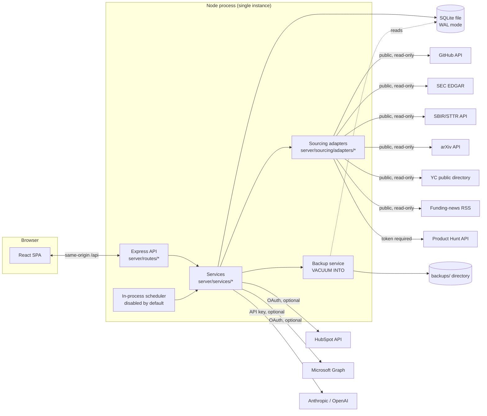
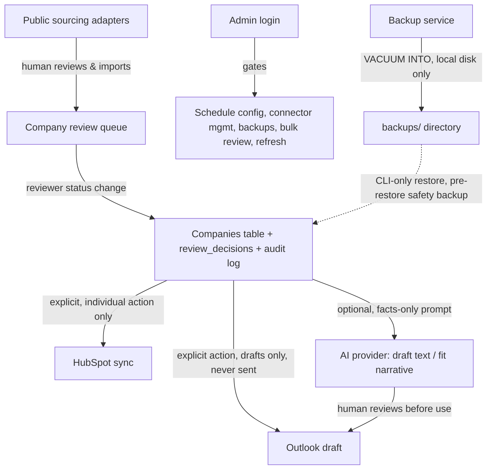

# Vamos Deal Radar — Security Review Package

Prepared for: Pliancy (IT/security review)
Prepared by: Vamos Ventures engineering
Status: **Draft for review. No security approval has been granted for this application yet. It is not deployed anywhere outside a developer's local machine.**

This document describes the system as it exists in the repository today. It does not claim any external integration (HubSpot, Outlook, an AI provider) has been exercised against the real production service from any environment Vamos controls — see [`LIVE_READINESS.md`](LIVE_READINESS.md) for the exact verification status of each. Where this document says a control exists, it means the control exists in code and is covered by an automated test; it does not mean the control has been red-teamed or reviewed by a third party.

---

## 1. Executive summary

**What it is.** Vamos Deal Radar is an internal deal-sourcing and review tool for Vamos Ventures. It pulls public startup signals from a small set of public APIs and feeds (GitHub, SEC EDGAR, SBIR/STTR, arXiv, Y Combinator's public directory, public funding-news RSS, optionally Product Hunt), lets a human reviewer triage the resulting candidates, tracks reviewed companies through a simple status lifecycle, and optionally pushes an approved company into HubSpot or drafts (never sends) an Outlook email. An AI provider can optionally help draft outreach text and summarize fit; without a configured key it falls back to a deterministic local template built only from verified facts.

**Who uses it.** A small internal team at Vamos Ventures (expected: 1–3 people). There is no multi-tenant or external-user surface.

**Current deployment status.** Not deployed. Runs today only on a developer's local machine (`npm run dev` or `npm start` against a local SQLite file). No hosting provider has been selected; no production instance exists.

**Authentication design.** A single shared administrator password (`ADMIN_PASSWORD`) gates all admin-only actions (schedule configuration, connector enable/disable, database backups, bulk review actions, live research refresh). This is intentionally minimal for a 1–3 person internal tool and is **not** a per-user identity system — see [§6 Known risks](#6-known-risks).

**Why this review is being requested.** Before any hosting decision or credential is put in place, Vamos wants Pliancy's read on: the auth model, what external systems the app would talk to and with what scopes, how secrets are meant to be stored, and what's still missing before this could run somewhere persistent. See [§7](#7-requested-review-decisions) for the specific decisions being asked of Pliancy.

---

## 2. Architecture

- **Frontend**: React 19 + Vite SPA (`src/`). Talks to the backend only via same-origin `/api/*` fetches (dev: Vite proxies to the backend; production: the backend serves the built `dist/` bundle itself, so there is one origin).
- **Backend**: Node.js + Express 5 (`server/`), organized as one router module per domain under `server/routes/` (auth, status, discovery, imports, duplicates, hubspot, outlook, ai, outreach, stealth, portfolio, schedule, refresh, admin, health). Business logic lives in `server/services/`; routers only validate input (Zod), delegate, and shape the response.
- **Database**: SQLite (Node's built-in `node:sqlite` driver — no native/compiled dependency), WAL journal mode, one file on local disk (`server/.data/deal-radar.db` by default, configurable via `DATABASE_FILE`). A versioned, forward-only migration runner (`server/db/migrations.ts`) applies schema changes on boot.
- **Auth**: a single shared admin password, HMAC-signed session cookie, no per-user accounts (detailed in §5).
- **Sourcing adapters**: one module per external public data source under `server/sourcing/adapters/`, each returning a typed outcome (`live` / `failed` / `skipped`) rather than throwing — one source failing never blocks the others.
- **Integration clients**: `server/services/hubspot.ts` (REST + OAuth), `server/services/outlook.ts` (Microsoft Graph, OAuth), `server/services/ai.ts` (Anthropic or OpenAI chat completion, optional).
- **Scheduler**: an in-process interval timer (`server/services/schedule.ts`) that re-runs the sourcing pipeline on a stored schedule. Disabled by default (`RUN_SCHEDULER=false`); when enabled, it runs only inside this same Node process — there is no separate worker or queue.
- **Backup**: `server/services/backup.ts` — SQLite `VACUUM INTO` snapshots to a sibling `backups/` directory, with a JSON metadata sidecar per file (counts/timestamps only).
- **Hosting assumption**: none yet. The Dockerfile and health endpoints (§10 of `IMPLEMENTATION_STATUS.md`) are written for a single-instance container with a persistent volume for the SQLite file; no cloud provider has been chosen.

---

## 3. Data-flow inventory

Each flow below lists: input → processing → storage → external destination → retention → human-approval point.

### 3.1 Public live sourcing (Discovery)
- **Input**: a human-triggered (or scheduled) search query — vertical, keywords, max results/API-call budget.
- **Processing**: one HTTP GET per enabled public adapter (GitHub, SEC, SBIR, arXiv, YC, RSS, optionally Product Hunt), each behind a timeout + single retry (`fetchWithTimeout`/`fetchWithRetry`, `server/lib/http.ts`) and an SSRF check (`isSafeExternalUrlResolved`). Results are Zod-validated, normalized, and matched against existing companies for likely duplicates.
- **Storage**: candidates land in a `discovery_candidates`-equivalent table awaiting review; nothing is written to the main `companies` table until a human imports it.
- **External destination**: none — this flow only *reads* from public APIs.
- **Retention**: candidates persist until reviewed/imported/discarded; sourcing runs are logged indefinitely (subject to normal DB retention/backup policy).
- **Human-approval point**: a person must explicitly select and import a candidate. No candidate is ever auto-imported.

### 3.2 Company review
- **Input**: a reviewer's status change (Awaiting Review → Monitor / Research Needed / Passed / Approved for HubSpot), individually or in a validated bulk batch (max 200 IDs per request).
- **Processing**: server validates the requested status is one of the allowed values, skips any company already in a terminal state (`Synced to HubSpot`) even inside a bulk request, and records a review-decision row plus an audit-log entry per change.
- **Storage**: `companies` table (status/timestamps) + `review_decisions` table (who/what/when) + audit log.
- **External destination**: none.
- **Retention**: indefinite, subject to backup/retention policy.
- **Human-approval point**: every status change is itself the human-approval action — there is no automatic status transition except a company becoming "stale" (a display flag, not a status change) after a configurable number of days.

### 3.3 HubSpot sync
- **Input**: a reviewer explicitly clicking "Sync to HubSpot" (or "Search HubSpot") on one company. There is **no bulk HubSpot sync** — the bulk review-queue actions explicitly exclude HubSpot-bound statuses.
- **Processing**: builds a company/deal/contact payload from verified fields only, calls the HubSpot REST API (private-app token or OAuth access token), maps fields to `vamos_*` custom properties.
- **Storage**: the resulting HubSpot record ID(s) and sync timestamp are stored back on the local company row; a failure is recorded for retry visibility.
- **External destination**: HubSpot (`api.hubapi.com`).
- **Retention**: local sync-status record persists indefinitely; HubSpot's own retention applies to the record created there.
- **Human-approval point**: the sync action itself. Never triggered automatically or in bulk.

### 3.4 Outlook draft creation
- **Input**: a reviewer composing/generating outreach text for one company and choosing "Create draft."
- **Processing**: validates a well-formed recipient address and non-empty subject, calls Microsoft Graph to create a **draft** message in the connected mailbox.
- **Storage**: draft ID + web link + creation timestamp stored locally for status tracking; the encrypted OAuth token pair is stored in the local DB (see §4 secret inventory), never sent to the browser.
- **External destination**: Microsoft Graph (`graph.microsoft.com`) — a draft in the connected mailbox.
- **Retention**: draft persists in the mailbox per the mailbox owner's own retention; local tracking record persists indefinitely.
- **Human-approval point**: there is **no send path anywhere in this codebase** — a human must open the draft in Outlook/Graph and send it themselves. This is a deliberate, hard architectural constraint, not a configuration toggle.

### 3.5 Optional AI use (outreach drafting / fit analysis)
- **Input**: a company's verified facts (name, vertical, stage, evidence) plus a template selection.
- **Processing**: if `AI_PROVIDER`/a key is configured, sends a prompt built only from stored facts to Anthropic or OpenAI's chat-completion endpoint and validates the response against a fact-guard (no invented funding, traction, customers, or accelerators — output that fails the guard is rejected, not silently passed through). Without a key, the same call site returns a deterministic local template, clearly labeled as such in the UI.
- **Storage**: generated draft text is stored with the company record; the prompt/response themselves are not separately logged.
- **External destination**: Anthropic (`api.anthropic.com`) or OpenAI (`api.openai.com`), whichever is configured — only company facts already stored in the local DB are sent, no free-text PII fields exist in the schema to leak.
- **Retention**: subject to the provider's own data-retention policy for API calls — **not yet reviewed by Vamos**; see the "AI usage/retention" item in §7.
- **Human-approval point**: a human reviews and (if using Outlook) manually sends any drafted text; the AI never sends anything itself.

### 3.6 Authentication
- **Input**: the shared admin password, submitted from the Settings login form.
- **Processing**: constant-time comparison (`crypto.timingSafeEqual`) against `ADMIN_PASSWORD`; on match, issues an HMAC-SHA256-signed, base64url session token good for 12 hours.
- **Storage**: the token lives only in an `HttpOnly`, `SameSite=Lax` cookie (`Secure` when `NODE_ENV=production`) on the client; the server verifies it stateless-ly (no server-side session store) by re-computing the HMAC.
- **External destination**: none.
- **Retention**: 12-hour cookie `maxAge`; failed/successful attempts are audit-logged (see §3.7). A login-attempt rate limiter (10 attempts / 15 minutes / IP) applies.
- **Human-approval point**: n/a — this *is* the approval gate for every other admin action.

### 3.7 Audit logs
- **Input**: every admin login attempt, admin-gated action, and idempotency/duplicate-submission block.
- **Processing**: every `subject`/`detail` string passes through `redactSecrets()` (`server/lib/guard.ts`) before storage, replacing anything matching a secret-shaped pattern (bearer tokens, `sk-`-style API keys, long hex strings, JWT-shaped strings) with `[redacted]`.
- **Storage**: an in-process append-only log (capped at the 500 most recent entries), persisted via the legacy JSON key-value store (`server/lib/store.ts`), separate from the SQLite company data.
- **External destination**: none.
- **Retention**: last 500 entries only — there is currently no long-term/exportable audit trail. Flagged in §6.
- **Human-approval point**: n/a (a passive record).

### 3.8 Backups
- **Input**: an admin clicking "Create backup now," a scheduled/CLI `npm run db:backup`, or the (documented, CLI-only) `npm run db:restore`.
- **Processing**: `VACUUM INTO` produces one consistent snapshot file (WAL-safe) in a sibling `backups/` directory; a JSON metadata sidecar (file name, size, schema version, company count, timestamp — never row contents) is written alongside it. Retention pruning (default: keep at most 14 files or 30 days, whichever is reached first) runs after every successful backup. Restoring requires the CLI, validates the target file's SQLite header and integrity, takes a pre-restore safety backup automatically, and rolls back on any integrity-check failure.
- **Storage**: local disk only, outside the active database path.
- **External destination**: none — there is intentionally no remote/cloud backup destination configured yet.
- **Retention**: governed by the `maxBackups`/`maxBackupAgeDays` settings above (admin-configurable, 1–500 files / 1–3650 days).
- **Human-approval point**: creation can be automatic (scheduled) or manual; restore is **always** a deliberate, documented CLI action — there is no "restore" button anywhere in the browser UI, by design.

---

## 4. External systems

| System | Data sent | Data received | Auth method | Live-verified? | Required scopes | Rate limits | Known risks |
|---|---|---|---|---|---|---|---|
| GitHub REST API (`api.github.com`) | Search query terms (company/keyword strings) | Public repo metadata | None required; optional `GITHUB_TOKEN` (personal access token) raises rate limit | Verified reachable (health check calls it); used read-only in this app | None (token, if any, is a plain PAT with no special scope requested) | 60 req/hr unauthenticated, 5,000/hr with a token (GitHub's own limits) | Public data only; token, if used, should be a minimal-scope or scope-less PAT |
| SEC EDGAR full-text search (`efts.sec.gov`, `www.sec.gov`) | Search query terms | Public Form D filing metadata | None; SEC asks automated clients to self-identify via `SEC_CONTACT_EMAIL` in the User-Agent | Not yet exercised against production traffic patterns | None | SEC's published fair-use guidance (not a hard-enforced key-based limit) | Public data only |
| SBIR/STTR awards API (`api.www.sbir.gov`) | Search query terms | Public federal award records | None | Not yet exercised at volume | None | Unpublished/unknown — treated conservatively via existing budget caps | Public data only |
| arXiv API (`export.arxiv.org`) | Search query terms | Public paper metadata | None | Implemented, unit-tested | None | arXiv's published fair-use guidance | Public data only |
| Y Combinator public directory (`api.ycombinator.com`) | Search query terms | Public company directory entries | None | Implemented, unit-tested | None | Unpublished/unknown | Public data only; unofficial/undocumented endpoint, could change without notice |
| Public funding-news RSS (TechCrunch feeds, configurable via `FUNDING_NEWS_FEEDS`) | None (GET only) | Public RSS feed content | None | Implemented, unit-tested | None | n/a (static feed fetch) | Public data only |
| Product Hunt API (`api.producthunt.com`) | Search query terms | Public product/launch metadata | Developer token (`PRODUCTHUNT_TOKEN`) via GraphQL API | **Not connected in any environment** — shows "Credentials required" until a real token is set | Whatever scope Product Hunt's developer token grants (read-only product data; no write scope requested) | Product Hunt's published API limits | No token currently held anywhere; adapter refuses to run without one (never simulates success) |
| HubSpot API (`api.hubapi.com`, OAuth at `app.hubspot.com`) | Company/contact/deal fields for records a reviewer explicitly chose to sync; search queries | Created/updated record IDs, existing record data for the search feature | Private-app token **or** OAuth authorization-code flow | **Not connected in any environment** — no token/OAuth app configured anywhere yet | `crm.objects.companies.{read,write}`, `crm.objects.contacts.{read,write}`, `crm.objects.deals.{read,write}`, `crm.objects.notes.write` | HubSpot's published per-app limits | No live traffic yet; scopes above are the ones the OAuth flow requests — Pliancy input requested on whether these are appropriately scoped (§7) |
| Microsoft Graph (`graph.microsoft.com`, OAuth at `login.microsoftonline.com`) | Draft email content (subject/body/recipient) for outreach a reviewer explicitly generated | Draft creation confirmation, mailbox display name, draft status | OAuth authorization-code flow, server-side `state` validated against a stored, expiring value | **Not connected in any environment** — no Entra app registered yet | `offline_access`, `Mail.ReadWrite`, `User.Read` | Microsoft Graph's published throttling limits | No live traffic yet; `Mail.ReadWrite` is broader than strictly needed for draft-only creation — flagged for Pliancy's scope review in §7 |
| Anthropic (`api.anthropic.com`) / OpenAI (`api.openai.com`) | Company facts already in the local DB, formatted into a prompt | Generated draft text / fit narrative | API key (`ANTHROPIC_API_KEY` / `OPENAI_API_KEY` / generic `AI_API_KEY`) | **Not connected in any environment** — no key configured anywhere yet | n/a (API key, not scoped) | Provider's published per-key rate limits | Provider-side data-retention policy for API calls has not been reviewed by Vamos — flagged in §7 |

---

## 5. Secret inventory

No actual secret values appear anywhere in this document, the codebase, or its history — this table describes *what each secret is for*, never its value.

| Secret | Purpose | Storage | Rotation | Required or optional | Frontend-exposed? |
|---|---|---|---|---|---|
| `ADMIN_PASSWORD` | Gates every admin-only action (schedule, connectors, backups, bulk review, refresh) | `.env` on the backend host only | Manual — no rotation tooling exists yet | **Required** for any admin feature to work at all (app runs with zero credentials otherwise, but admin actions are then entirely disabled, not open) | No — the frontend never receives or displays it; only a boolean "configured" flag is exposed |
| `SESSION_SECRET` | Derives (a) the HMAC key that signs the admin session cookie and (b) the AES key that encrypts stored OAuth tokens at rest | `.env` | Manual. **Rotating it invalidates every existing admin session and every stored OAuth token** (Outlook would need reconnecting) | Optional, but strongly recommended for any persistent deployment — without it, a random key is generated per process start, so a restart forces re-login and would break any stored Outlook token | No |
| `HUBSPOT_ACCESS_TOKEN` | Private-app token for direct HubSpot API access (alternative to OAuth) | `.env` | Manual, via HubSpot's own private-app token rotation | Optional (HubSpot simply reports "not connected" without it) | No |
| `HUBSPOT_CLIENT_ID` / `HUBSPOT_CLIENT_SECRET` / `HUBSPOT_REDIRECT_URI` | OAuth app credentials for the HubSpot connect flow | `.env` | Manual, via HubSpot's app settings | Optional (alternative to the private-app token) | No — `HUBSPOT_CLIENT_ID` is technically not secret (it's sent in the OAuth redirect URL), `HUBSPOT_CLIENT_SECRET` never leaves the backend |
| `MICROSOFT_CLIENT_ID` / `MICROSOFT_CLIENT_SECRET` / `MICROSOFT_TENANT_ID` / `MICROSOFT_REDIRECT_URI` | Entra (Azure AD) app registration for the Outlook OAuth flow | `.env` | Manual, via Entra app settings | Optional (Outlook reports "not connected" without them) | No |
| Stored Outlook OAuth token pair (access + refresh) | Lets the backend call Graph on the connected mailbox's behalf | SQLite, **encrypted at rest** with a key derived from `SESSION_SECRET` | Refresh token itself rotates per Microsoft's OAuth lifecycle; the encryption key rotates only if `SESSION_SECRET` changes | N/A (generated by the OAuth flow, not configured directly) | No — never sent to the browser |
| `AI_PROVIDER` / `AI_API_KEY` / `ANTHROPIC_API_KEY` / `OPENAI_API_KEY` | Enables live AI-generated outreach/analysis text | `.env` | Manual, via the provider's own key rotation | Optional (falls back to a deterministic local template without one) | No |
| `GITHUB_TOKEN` | Raises the GitHub public-API rate limit | `.env` | Manual | Optional | No |
| `SEC_CONTACT_EMAIL` | Identifies this app to SEC EDGAR per their automated-client guidance | `.env` | N/A (not a secret, just a contact string) | Optional (SEC accepts default identification without it, per current adapter behavior) | No |
| `PRODUCTHUNT_TOKEN` | Enables the Product Hunt discovery adapter | `.env` | Manual, via Product Hunt developer settings | Optional (adapter refuses to run, never simulates, without it) | No |
| `DATABASE_FILE` / `DATA_FILE` | Path to the SQLite file (not a secret, but controls where all of the above data physically lives) | `.env` | N/A | Optional (sensible default) | No |

---

## 6. Security controls

- **Admin authentication**: single shared password, constant-time comparison, fails closed (unset `ADMIN_PASSWORD` = feature entirely disabled, not open). See §3.6.
- **Session cookie**: `HttpOnly` (unreadable by frontend JS), `SameSite=Lax`, `Secure` in production, 12-hour expiry, HMAC-SHA256 signed and verified with `crypto.timingSafeEqual` (no timing side-channel on signature comparison).
- **Password handling**: never logged, never echoed back, compared only via `timingSafeEqual`; length-mismatch short-circuits before the constant-time compare (a length signal is accepted here as not meaningfully sensitive for a single shared password).
- **Rate limiting**: global `/api` limiter (300 req/min/IP in production), a stricter login limiter (10 attempts/15 min/IP), a stricter outreach-generation limiter (30/min), and a stricter live-research-refresh limiter (20/min) — each mounted via `express-rate-limit` at the specific route it protects.
- **Input validation**: every request body/query is parsed through a Zod schema before use; malformed input is rejected with a 400, never partially processed.
- **External-response validation**: every adapter/integration response is validated through its own Zod schema (`validateExternal`) before being trusted — a public API returning unexpected shapes fails closed (`invalid-response`) rather than propagating garbage into the DB.
- **SSRF protections**: `isSafeExternalUrlResolved()` rejects non-http(s) schemes, loopback/private/link-local hostname literals, and (via a DNS lookup at call time) any hostname that *resolves* to a private/loopback/link-local address — closing the gap where a public-looking hostname points at internal infrastructure. **Known residual gap**: the resolved address isn't pinned for the fetch that immediately follows, leaving a narrow DNS-rebinding TOCTOU window (documented in `KNOWN_LIMITATIONS.md`; closing it fully would require a custom fetch agent that connects to the pre-resolved IP).
- **Timeouts and retries**: every outbound call uses `fetchWithTimeout` (default 10s, 8s for GitHub) via `AbortController`, with `fetchWithRetry` retrying once on a 429/5xx or network failure after a short backoff — bounded, not infinite.
- **Audit logging**: admin logins (success/failure), admin-gated actions, and blocked duplicate submissions are recorded with secret redaction applied before storage (see §3.7). **Known gap**: capped at the 500 most recent entries with no export/long-term archive yet (§7).
- **Error sanitization**: `sanitizeErrorForClient` (`server/lib/errors.ts`) strips stack traces and internal detail from client-facing error responses; 5xx errors are logged server-side (skipped in `NODE_ENV=test` to keep test output clean) but never echoed to the client.
- **Secret redaction**: `redactSecrets()` scrubs bearer tokens, `sk-`-style keys, long hex strings, and JWT-shaped strings from any text before it's audit-logged — a defensive backstop in case a call site ever accidentally interpolates a secret into a log string, not the primary control (the primary control is simply never putting secrets in log strings).
- **Outlook is drafts-only**: there is no code path anywhere in this application that sends an email — verified by inspection of every Graph call site, all of which target the draft-creation endpoint only.
- **No automatic CRM or email actions**: every HubSpot sync and every Outlook draft requires an explicit, individual human click. Bulk review-queue actions are restricted (server-side, not just UI-hidden) to non-CRM statuses.
- **Backup protections**: backups never overwrite the active database; restore always takes an automatic pre-restore safety backup of the current file, validates the target file's SQLite header and runs `PRAGMA integrity_check` before *and* after the restore, and automatically rolls back to the safety backup on any integrity failure. Restore is CLI-only — there is no browser-triggerable restore endpoint.
- **Idempotency guard**: mutating requests carrying an `Idempotency-Key` header are rejected if the same key was seen in the last two minutes, preventing a double-clicked button from creating duplicate CRM records or drafts.

---

## 7. Known risks

- **Shared admin password, not per-user identity.** One password for the whole team, not SSO/individual accounts. Adequate for a 1–3 person internal tool; **not** something to scale to a larger team without adding real user identity (a per-user login, and per-user attribution in the audit log, would both need to be built).
- **No named user identities in the audit log.** Every admin action is attributed to "admin" (the shared account), not an individual — if Pliancy requires individual accountability for admin actions, this needs a real identity layer first.
- **Audit log has no long-term retention.** Capped at 500 entries in an in-process JSON store; there is no export, no external log sink, and a process restart doesn't lose it (it's file-backed) but nothing prunes it intelligently beyond the 500-entry cap.
- **SQLite is a single-instance datastore.** No built-in replication or multi-writer support; this rules out horizontal scaling or multi-region deployment without a database migration (to Postgres or similar) first. Fine for the current single-admin-team scale; a real constraint on future growth.
- **DNS-rebinding TOCTOU window in the SSRF guard.** Documented above (§6) — narrow, but present. Closing it fully requires a custom fetch agent, not yet built.
- **Optional integrations are implemented but untested against real production traffic from any Vamos-controlled environment.** HubSpot, Outlook, and the AI providers all have working, unit-tested client code, but none have been exercised against a real account/token from this codebase — see `LIVE_READINESS.md` for the current status of each, verified as of this document's writing.
- **No hosting provider has been selected.** The Dockerfile, health endpoints, and graceful-shutdown behavior are written for *a* container host, but no specific provider, region, or persistent-volume backend has been chosen or reviewed.
- **No Pliancy security approval has been granted as of this document.** This package exists to request that review, not to report its outcome.
- **AI data-sharing has not been reviewed.** If an AI key is ever configured, company facts would be sent to Anthropic or OpenAI's API per their own data-retention terms — Vamos has not yet reviewed those terms against any internal data-handling policy.
- **Backup retention/restore is new and CLI-driven, with real but limited test coverage.** Automated tests cover backup creation, restore-produces-expected-records, invalid-backup rejection, and pre-restore safety-backup creation — but there has been no chaos/failure-injection testing (e.g., a restore interrupted mid-copy) beyond what the integrity-check-and-rollback path is designed to catch.
- **Admin authorization is all-or-nothing.** There is no concept of a lower-privilege reviewer role distinct from a full administrator — anyone with the shared password can do everything an admin can do, including database backups and schedule changes.

---

## 8. Requested review decisions

1. **Development-tool approval** — is Vamos's use of VS Code and Claude Code (Anthropic's coding assistant) against this codebase acceptable under Pliancy's tooling policy, given the codebase itself contains no real secrets (see §5) and no external system has live credentials configured?
2. **Hosting architecture** — what hosting provider/architecture should this run on (single container vs. managed platform), and what constraints (region, network isolation, persistent-volume requirements for SQLite) should shape that choice?
3. **Temporary auth model** — is the single-shared-password admin model (§3.6, §6) acceptable for an initial internal deployment, or should a real per-user identity/SSO layer be a prerequisite before any deployment?
4. **HubSpot OAuth scopes** — are the requested scopes (`crm.objects.{companies,contacts,deals}.{read,write}` plus `crm.objects.notes.write`, listed in full in §4) appropriately minimal, or should this be narrowed (e.g., companies-only, or deferring notes) for an initial rollout?
5. **Microsoft Graph scopes** — `Mail.ReadWrite` is broader than strictly required for draft-only creation; should this be narrowed to a more specific draft-only permission if Microsoft offers one, before any Entra app is registered?
6. **AI usage and data retention** — is sending company facts (never PII beyond what's already public) to Anthropic or OpenAI's API acceptable, and does it need a Business Associate/data-processing agreement or specific retention settings on the provider side first?
7. **SQLite vs. Postgres** — is SQLite acceptable for the initial deployment scale (single admin team, low write volume), or should this migrate to a managed relational database before going live?
8. **Secret management** — should `.env`-file secrets on the host be replaced with a managed secret store (e.g., the hosting provider's own secrets manager) before deployment, rather than files on disk?
9. **Backup requirements** — are the current defaults (max 14 files or 30 days, local-disk-only, no offsite/cloud copy) sufficient, or does Pliancy require an offsite backup destination before go-live?
10. **Logging and monitoring** — does Pliancy require centralized log shipping or alerting beyond the current in-process audit log and console request log before this can run in a shared environment?
11. **SSO requirement** — should individual SSO-backed accounts be a hard requirement before deployment, superseding the shared-password model entirely, or is the shared password acceptable for a bounded initial rollout with a committed timeline to add real accounts?

---

## Appendix: data-flow diagram (all flows together)

